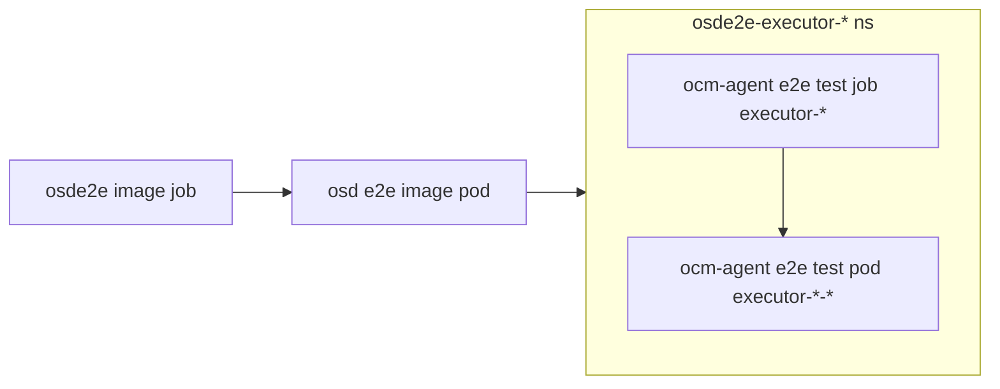

# OCM Agent E2E Test Suite

This directory contains the end-to-end (E2E) test suite for the OCM Agent service. The test suite has been recently refactored for better organization, maintainability, and readability.

## Test Suite Overview

The E2E test suite in `ocm_agent_tests.go` contains **4 main test categories** with **26 individual test steps**, providing comprehensive coverage of OCM Agent functionality.

### Test Categories Summary

#### 1. **OcmAgentCommon - Basic Deployment Tests** (2 tests)

**Test 1: "Testing basic deployment"**
- Step 1: Verifying that the namespace exists
- Step 2: Verifying that the deployment exists (both `ocm-agent` and `ocm-agent-operator`)

**Test 2: "Testing common ocm-agent tests"**
- Step 1: Listing ocm-agent pods for testing
- Step 2: Verifying ocm-agent service is ready
- Step 3: Testing health check endpoints (`/livez` and `/readyz`)
- Step 4: Verifying invalid endpoint returns 4xx error
- Step 5: Testing limited support reasons full workflow
  - Step 5a: Creating limited support reason via OCM client
  - Step 5b: Finding the created limited support reason to get its ID
  - Step 5c: Testing limited support reasons retrieval through ocm-agent
  - Step 5d: Testing specific limited support reason retrieval

#### 2. **OcmAgentClassic - Alert Processing Tests** (1 test)

**Test: "Testing alert processing for classic mode"**
- Step 1: Creating and managing default ManagedNotification
- Step 2: Verifying HTTP GET is not supported on alertmanager-receiver
- Step 3: Sending service log for a firing alert
- Step 4: Verifying alert has notification template associated
- Step 5: Posting single alert, service log count should increase by 1
- Step 6: Verifying no duplicate service log for same firing alert within resend period
- Step 7: Sending service log for resolved alert
- Step 8: Firing 2 alerts, service log count should increase by 2
- Step 9: Resolving 2 alerts, service log count should increase by 2
- Step 10: Verifying ocm-agent is still healthy after alert tests

#### 3. **OcmAgentHCP - Fleet Mode Tests** (1 test)

**Test: "Testing ocm-agent tests in fleet mode"**
- Step 1: Testing ocm-agent-fleet healthcheck endpoints
- Step 2: Creating test ManagedFleetNotification templates
- Step 3: Sending service log for a firing alert

### Key Test Features

#### **Setup and Configuration**
- Kubernetes client initialization
- OCM connection establishment
- Network policy creation for testing
- Mock error server setup
- Cluster ID resolution (external and internal)

#### **Health and Connectivity Testing**
- Pod availability verification
- Service readiness checks
- Health endpoint testing (`/livez`, `/readyz`)
- Error handling for invalid endpoints

#### **Alert Processing Testing**
- Single alert processing (firing/resolved)
- Multiple alert processing
- Duplicate alert prevention
- Service log generation and counting
- Notification template validation

#### **Fleet Mode Testing**
- Fleet notification templates
- Fleet-specific alert processing

#### **OCM Integration Testing**
- Service log creation and retrieval
- Limited support reason management
- Cluster management API testing
- OCM client functionality

### Test Utilities

The tests leverage common utilities from `pkg/consts/test/test.go`:

- `CreateNetworkPolicy()` - Network policy creation
- `CreateDefaultNotification()` - Managed notification setup
- `CreateSingleAlert()` / `CreateBiAlert()` - Alert payload creation
- `PostAlert()` - Alert submission
- `GetServiceLogCount()` / `CheckServiceLogCount()` - Service log verification
- `CreateFleetAlert()` - Fleet mode alert creation
- `GetLimitedSupportCount()` / `CheckLimitedSupportCount()` - Limited support verification
- `GetMfnriCount()` / `CheckMfnriCount()` - Fleet notification record verification

### Test Labels

Tests are categorized with labels for selective execution:
- `OcmAgentCommon` - Basic functionality tests
- `OcmAgentClassic` - Traditional alert processing
- `OcmAgentHCP` - Fleet mode functionality

This comprehensive test suite ensures the OCM Agent service functions correctly across different deployment modes and scenarios, providing confidence in both basic operations and advanced fleet management capabilities.

## Test Structure Improvements

### Recent Refactoring

The test suite has been significantly improved with the following changes:

- **Common Test Utilities**: Shared test functions and structs have been moved to `pkg/consts/test/test.go` for better reusability
- **Standardized Test Descriptions**: All `ginkgo.By` descriptions now follow a uniform format:
  - `Setup:` for initialization and configuration steps
  - `Step X:` for test execution steps  
  - `Cleanup:` for teardown operations
- **Improved Readability**: Test files are now more readable with consistent formatting and better organization

## Prerequisites

Before running the E2E tests, ensure you have:

- Go 1.23+ installed
- Access to a Kubernetes cluster with OCM Agent deployed
- OCM credentials (token or client ID/secret)
- `ginkgo` test runner installed

## Installation

Install the required dependencies:

```bash
# Install Ginkgo test runner
go install github.com/onsi/ginkgo/v2/ginkgo@latest

# Build the E2E test binary
make e2e-binary-build
```

## Running Tests Locally

### Basic Setup

1. **Build the test binary**:
   ```bash
   make e2e-binary-build
   ```

2. **Get cluster credentials**:
   ```bash
   ocm get /api/clusters_mgmt/v1/clusters/$INTERNAL_CLUSTERID/credentials | jq -r .kubeconfig > /path/to/kubeconfig
   ```

3. **Run the complete test suite**:
   ```bash
   DISABLE_JUNIT_REPORT=true KUBECONFIG=/path/to/kubeconfig ginkgo --tags=osde2e -v test/e2e
   ```

### Running Specific Test Categories

#### Common Tests (Basic Deployment)
```bash
DISABLE_JUNIT_REPORT=true KUBECONFIG=/path/to/kubeconfig ginkgo run --tags=osde2e -vv --focus="OcmAgentCommon*" test/e2e/
```

#### Classic Mode Tests
```bash
DISABLE_JUNIT_REPORT=true KUBECONFIG=/path/to/kubeconfig ginkgo run --tags=osde2e -vv --focus="OcmAgentClassic*" test/e2e/
```

#### Fleet Mode Tests
```bash
DISABLE_JUNIT_REPORT=true KUBECONFIG=/path/to/kubeconfig ginkgo run --tags=osde2e -vv --focus="OcmAgentHCP*" test/e2e/
```

### Running and testing ocm-agent in different modes against a staging cluster

When testing against a remote cluster, use port forwarding to access the OCM Agent service:

1. **In one terminal session use the existing `build-and-run.sh` script:**
   - Run `ocm-agent` in classic mode (uses accesstoken)
   ```bash
   ${REPO_ROOT_DIR}/test/build-and-run.sh $CLUSTERNAME
   ```
   - Run `ocm-agent` in fleet mode (uses client ID and secret)
   ```bash
   ${REPOROOT_DIR}/test/build-and-run.sh $CLUSTERNAME --fleet-mode
   ```
   - Run `ocm-agent` in test mode (fleet mode with accesstoken)
   ```bash
   ${REPO_ROOT_DIR}/test/build-and-run.sh $CLUSTERNAME --fleet-mode --test-mode
   ```

3. **In another terminal run tests with local URL**:
   ```bash
   OCM_TOKEN=$(ocm token) OCM_AGENT_URL=http://localhost:8081 DISABLE_JUNIT_REPORT=true KUBECONFIG=/path/to/kubeconfig ginkgo --tags=osde2e -v test/e2e
   ```

### Architecture Diagram

```
                   ┌──────────────────────┐
                   │ Kubernetes Cluster   │
┌─────────────────┐│    ┌───────────────┐ │
│   Test Runner   ││    │  ocm-agent    │ │
│ (local machine) ││    │     Pod       │ │
│                 ││    │   (port 8081) │ │
└─────────────────┘│    └───────────────┘ │
           │       │              │       │
           │  oc port-forward     │       │
           │       │              │       │
           └──────────────────────┘       │
                   │                      │
                   └──────────────────────┘
```

## Fleet Mode Testing

### Running Fleet Mode Tests Locally

1. **Build and run OCM Agent in fleet mode**:
   ```bash
   ./test/build-and-run.sh ${CLUSTERNAME} --fleet-mode
   ```

2. **Run fleet mode tests**:
   ```bash
   OCM_TOKEN=$(ocm token) OCM_AGENT_URL=http://localhost:8081 DISABLE_JUNIT_REPORT=true KUBECONFIG=/path/to/kubeconfig ginkgo --tags=osde2e -vv --focus="OcmAgentHCP*" test/e2e
   ```

## E2E Image Testing

### Running in Cluster

The E2E tests can be executed as a job within an existing cluster:

1. **Set environment variables**:
   ```bash
   export TEST_IMAGE="quay.io/your-org/ocm-agent-e2e"
   export IMAGE_TAG="latest"
   export OCM_E2E_TOKEN=$(ocm token)
   export AWS_ACCESS_KEY_ID="your-access-key"
   export AWS_SECRET_ACCESS_KEY="your-secret-key"
   export REGION="us-east-1"
   export CLUSTER_ID="your-cluster-id"
   export OSD_ENV="stage"
   ```

2. **Deploy the test job**:
   ```bash
   envsubst < ./test/e2e/e2e-image-job.yaml | oc apply --as backplane-cluster-admin -f -
   ```

### Debugging E2E Image Tests

The E2E image test workflow:



To debug:

1. **Find the executor namespace**:
   ```bash
   oc get namespace | grep osde2e
   ```

2. **Check test logs**:
   ```bash
   oc -n osde2e-executor-<id> logs executor-<id> --as backplane-cluster-admin
   ```

3. **Debug with detailed output**:
   ```bash
   oc -n osde2e-executor-<id> exec -it executor-<id> -- /e2e.test --ginkgo.vv --ginkgo.trace --ginkgo.fail-on-empty
   ```

## Test Development Guidelines

### Adding New Tests

When adding new E2E tests:

1. **Use common utilities**: Leverage functions from `pkg/consts/test/test.go`
2. **Follow naming conventions**: Use descriptive test names and labels
3. **Use standardized descriptions**: Follow the `Setup:`, `Step X:`, `Cleanup:` format

### Test Organization

- **Test files**: Place in `test/e2e/` directory
- **Common utilities**: Add to `pkg/consts/test/test.go`
- **Test data**: Use `test/files/` for test fixtures
- **Manifests**: Use `test/manifests/` for test resources

## Troubleshooting

### Common Issues

1. **Tests skipped**: Check OCM credentials and cluster connectivity
2. **Port forwarding issues**: Ensure the OCM Agent pod is running
3. **Build failures**: Verify Go version and dependencies

### Debug Commands

```bash
# Validate test structure
ginkgo outline test/e2e/ocm_agent_tests.go

# Run with maximum verbosity
ginkgo run --tags=osde2e -vv --trace test/e2e/
```

## Contributing

When contributing to the E2E test suite:

1. Ensure tests are comprehensive and cover edge cases
2. Use the standardized test description format
3. Leverage common test utilities when possible
4. Add appropriate test labels for categorization
5. Update this documentation when adding new test categories or procedures
