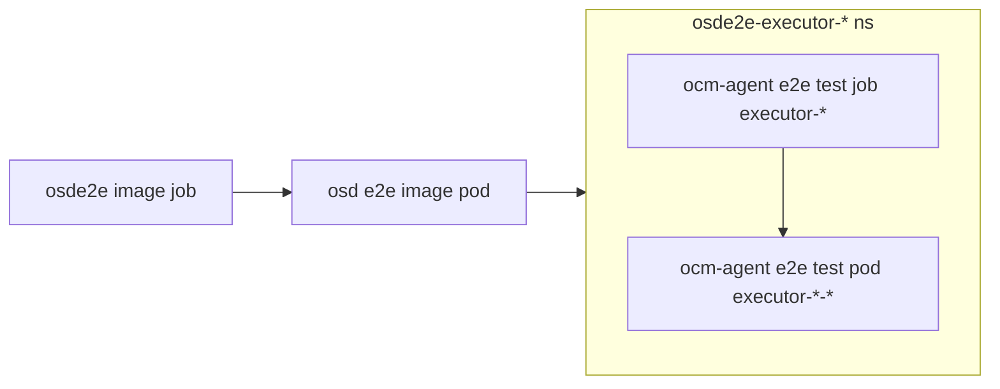

# OCM Agent E2E Test Suite

This directory contains the end-to-end (E2E) test suite for the OCM Agent service. The test suite has been recently refactored for better organization, maintainability, and readability.

## Test Structure Improvements

### Recent Refactoring

The test suite has been significantly improved with the following changes:

- **Common Test Utilities**: Shared test functions and structs have been moved to `pkg/consts/test/test.go` for better reusability
- **Standardized Test Descriptions**: All `ginkgo.By` descriptions now follow a uniform format:
  - `Setup:` for initialization and configuration steps
  - `Step X:` for test execution steps  
  - `Cleanup:` for teardown operations
- **Improved Readability**: Test files are now more readable with consistent formatting and better organization

### Test Categories

The E2E test suite includes three main test categories:

1. **OcmAgentCommon** - Basic deployment and health check tests
2. **OcmAgentClassic** - Traditional OCM Agent functionality testing
3. **OcmAgentHCP** - Fleet mode testing for multi-cluster management

## Prerequisites

Before running the E2E tests, ensure you have:

- Go 1.19+ installed
- Access to a Kubernetes cluster with OCM Agent deployed
- OCM credentials (token or client ID/secret)
- `ginkgo` test runner installed

## Installation

Install the required dependencies:

```bash
# Install Ginkgo test runner
go install github.com/onsi/ginkgo/v2/ginkgo@latest

# Build the E2E test binary
make e2e-binary-build
```

## Running Tests Locally

### Basic Setup

1. **Build the test binary**:
   ```bash
   make e2e-binary-build
   ```

2. **Get cluster credentials**:
   ```bash
   ocm get /api/clusters_mgmt/v1/clusters/$INTERNAL_CLUSTERID/credentials | jq -r .kubeconfig > /path/to/kubeconfig
   ```

3. **Run the complete test suite**:
   ```bash
   DISABLE_JUNIT_REPORT=true KUBECONFIG=/path/to/kubeconfig ./bin/ginkgo --tags=osde2e -v test/e2e
   ```

### Running Specific Test Categories

#### Common Tests (Basic Deployment)
```bash
DISABLE_JUNIT_REPORT=true KUBECONFIG=/path/to/kubeconfig ginkgo run --tags=osde2e -vv --label-filter="OcmAgentCommon" test/e2e/
```

#### Classic Mode Tests
```bash
DISABLE_JUNIT_REPORT=true KUBECONFIG=/path/to/kubeconfig ginkgo run --tags=osde2e -vv --label-filter="OcmAgentClassic" test/e2e/
```

#### Fleet Mode Tests
```bash
DISABLE_JUNIT_REPORT=true KUBECONFIG=/path/to/kubeconfig ginkgo run --tags=osde2e -vv --label-filter="OcmAgentHCP" test/e2e/
```

### Running with Port Forwarding

When testing against a remote cluster, use port forwarding to access the OCM Agent service:

1. **Find the OCM Agent pod**:
   ```bash
   oc get pods -n openshift-ocm-agent-operator -l app=ocm-agent
   ```

2. **Set up port forwarding**:
   ```bash
   oc -n openshift-ocm-agent-operator port-forward <ocm-agent-pod-name> 8081:8081
   ```

3. **Run tests with local URL**:
   ```bash
   OCM_TOKEN=$(ocm token) OCM_AGENT_URL=http://localhost:8081 DISABLE_JUNIT_REPORT=true KUBECONFIG=/path/to/kubeconfig ./bin/ginkgo --tags=osde2e -v test/e2e
   ```

### Architecture Diagram

```
                   ┌──────────────────────┐
                   │ Kubernetes Cluster   │
┌─────────────────┐│    ┌───────────────┐ │
│   Test Runner   ││    │  ocm-agent    │ │
│ (local machine) ││    │     Pod       │ │
│                 ││    │   (port 8081) │ │
└─────────────────┘│    └───────────────┘ │
           │       │              │       │
           │  oc port-forward     │       │
           │       │              │       │
           └──────────────────────┘       │
                   │                      │
                   └──────────────────────┘
```

## Fleet Mode Testing

### Running Fleet Mode Tests Locally

1. **Build and run OCM Agent in fleet mode**:
   ```bash
   ./test/build-and-run.sh ${CLUSTERNAME} --fleet-mode
   ```

2. **Run fleet mode tests**:
   ```bash
   OCM_TOKEN=$(ocm token) TESTING_MODE="FLEET" OCM_AGENT_URL=http://localhost:8081 DISABLE_JUNIT_REPORT=true KUBECONFIG=/path/to/kubeconfig ./bin/ginkgo --tags=osde2e -v test/e2e
   ```

## E2E Image Testing

### Running in Cluster

The E2E tests can be executed as a job within an existing cluster:

1. **Set environment variables**:
   ```bash
   export TEST_IMAGE="quay.io/your-org/ocm-agent-e2e"
   export IMAGE_TAG="latest"
   export OCM_E2E_TOKEN=$(ocm token)
   export AWS_ACCESS_KEY_ID="your-access-key"
   export AWS_SECRET_ACCESS_KEY="your-secret-key"
   export REGION="us-east-1"
   export CLUSTER_ID="your-cluster-id"
   export OSD_ENV="stage"
   ```

2. **Deploy the test job**:
   ```bash
   envsubst < ./test/e2e/e2e-image-job.yaml | oc apply --as backplane-cluster-admin -f -
   ```

### Debugging E2E Image Tests

The E2E image test workflow:



To debug:

1. **Find the executor namespace**:
   ```bash
   oc get namespace | grep osde2e
   ```

2. **Check test logs**:
   ```bash
   oc -n osde2e-executor-<id> logs executor-<id> --as backplane-cluster-admin
   ```

3. **Debug with detailed output**:
   ```bash
   oc -n osde2e-executor-<id> exec -it executor-<id> -- /e2e.test --ginkgo.vv --ginkgo.trace --ginkgo.fail-on-empty
   ```

## Test Development Guidelines

### Adding New Tests

When adding new E2E tests:

1. **Use common utilities**: Leverage functions from `pkg/consts/test/test.go`
2. **Follow naming conventions**: Use descriptive test names and labels
3. **Use standardized descriptions**: Follow the `Setup:`, `Step X:`, `Cleanup:` format
4. **Add appropriate labels**: Use `OcmAgentCommon`, `OcmAgentClassic`, or `OcmAgentHCP` labels

### Test Organization

- **Test files**: Place in `test/e2e/` directory
- **Common utilities**: Add to `pkg/consts/test/test.go`
- **Test data**: Use `test/files/` for test fixtures
- **Manifests**: Use `test/manifests/` for test resources

## Troubleshooting

### Common Issues

1. **Tests skipped**: Check OCM credentials and cluster connectivity
2. **Port forwarding issues**: Ensure the OCM Agent pod is running
3. **Build failures**: Verify Go version and dependencies

### Debug Commands

```bash
# Validate test structure
ginkgo outline test/e2e/ocm_agent_tests.go

# List available test labels
ginkgo labels test/e2e/

# Run with maximum verbosity
ginkgo run --tags=osde2e -vv --trace test/e2e/
```

## Contributing

When contributing to the E2E test suite:

1. Ensure tests are comprehensive and cover edge cases
2. Use the standardized test description format
3. Leverage common test utilities when possible
4. Add appropriate test labels for categorization
5. Update this documentation when adding new test categories or procedures
